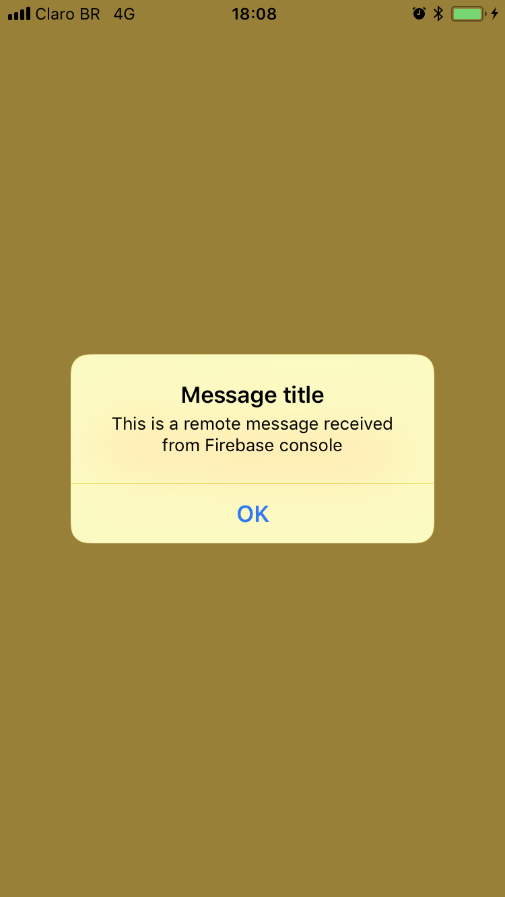

# Firebase test with carthage

This is a example project only to test Firebase with carthage.  

## Make

I have create a simple Makefile to easy update and clear carthage things, so simple.

> make help  

> make carthage-clear  
> make carthage-clear-cache  
> make carthage-update  

> make build-device  
> make build-simulator  

> make deploy-device  
> make deploy-simulator  

## Firebase for carthage

Im using this repository instructions:  

https://github.com/firebase/firebase-ios-sdk

## Run on device

To run on device using command line you need **node** and **ios-deploy** tool:

> brew install node  
> npm install -g ios-deploy  

## Run on simulator

To run on simulator using command line you need **node** and **ios-deploy** tool:

> brew install node  
> npm install -g ios-sim  

## Screenshots

  

  